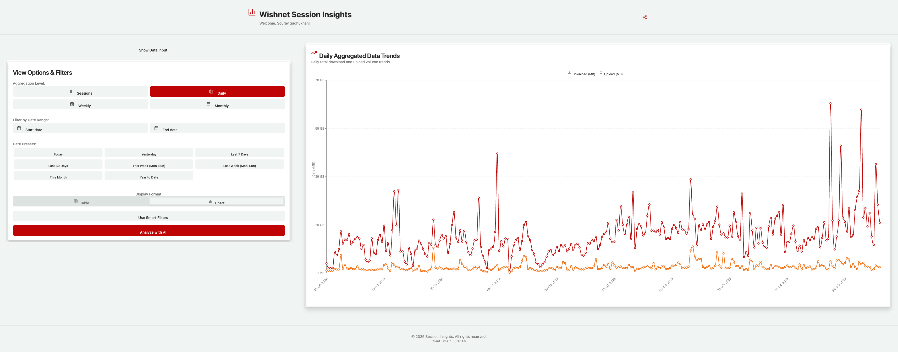
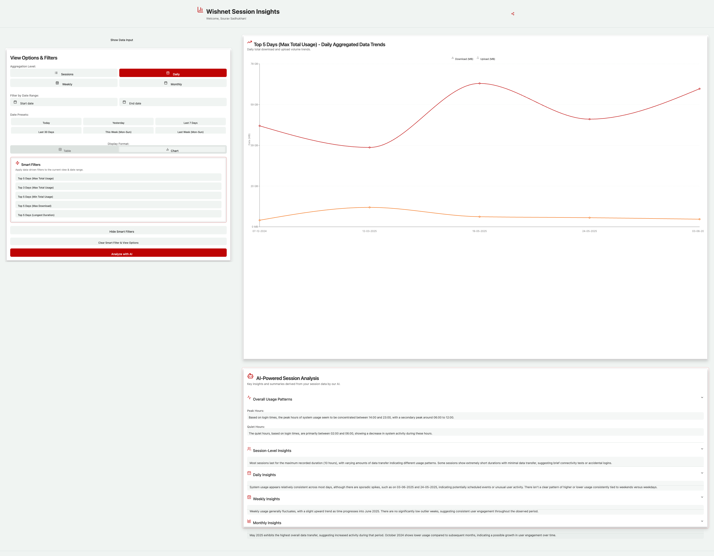
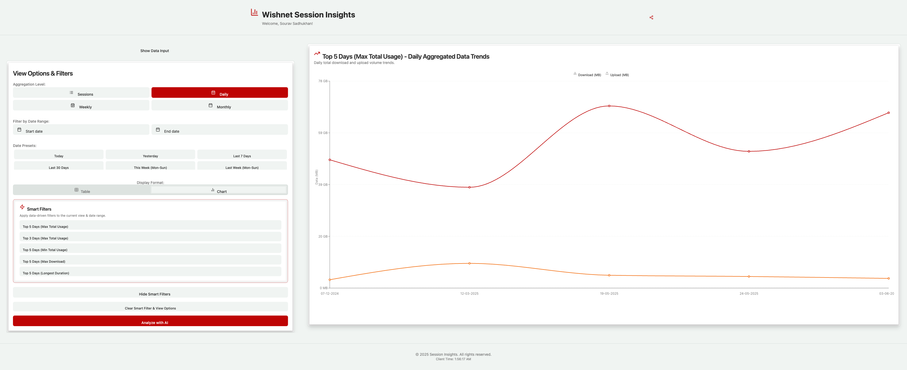

# Wishnet Session Insights

## Introduction

Welcome to **Wishnet Session Insights**, an innovative analytics dashboard crafted to transform the way you visualize and understand your internet usage. Tired of the uninspiring tables on the Wishnet broadband portal? This project, born from a personal need for vibrant and insightful data visualization, turns your network session data into captivating graphs and actionable insights. Powered by **Google Gemini AI**, this dashboard not only displays your usage but also uncovers hidden patterns to help you optimize your internet habits.

Fork this repository, connect it to the backend at https://github.com/SouravFrank/network-session-backend, or explore the simpler predecessor at https://github.com/SouravFrank/Wishnet-Usage-Tracker. Dive in and make your internet usage data come alive!

## Features

Wishnet Session Insights offers a robust suite of features to provide a comprehensive view of your network usage:

- **Data Input & Loading**:

  - **Automatic API Fetch**: Seamlessly retrieves session data from https://network-session-backend.onrender.com/api/network-usage on app load.
  - **Manual JSON Input**: Paste JSON-formatted session data if the API is unavailable.
  - **Loading Indicators**: Visual feedback during data fetching and processing.

- **Data Parsing & Validation**:

  - Ensures JSON input is an array of session objects with validated fields (e.g., `loginTime` in "DD-MM-YYYY HH:MM:SS", `sessionTime` in "HH:MM:SS", non-negative `download`/`upload`).
  - Provides clear error messages via `SessionDataParsingError` for invalid data.

- **Data Aggregation & Processing**:

  - **Individual Sessions**: View raw session data as-is.
  - **Daily Aggregation**: Summarizes usage per day, prorating sessions spanning midnight.
  - **Weekly Aggregation**: Groups data by calendar week (Monday-Sunday).
  - **Monthly Aggregation**: Summarizes usage by calendar month.
  - Calculates total duration, download/upload volumes, session counts, and inactive durations for each aggregation level.

- **Data Visualization & Display**:

  - **View Toggling**: Switch between intuitive table and chart views.
  - **Tabular Display**: Clean tables for individual sessions and daily aggregates; raw JSON for weekly/monthly aggregates in table view.
  - **Chart Display** (via shadcn/ui and Recharts):
    - **Session Timeline**: Line chart tracking download/upload over time.
    - **Daily Aggregation**: Line chart for daily usage trends.
    - **Weekly Aggregation**: Line chart for weekly trends.
    - **Monthly Aggregation**: Bar chart for monthly usage volumes.
    - Charts are sized at 70% of viewport height for maximum impact.

- **Data Filtering**:

  - **Aggregation Level Selection**: Toggle between Session, Daily, Weekly, and Monthly views.
  - **Date Range Filter**: Select custom "From" and "To" dates via calendar popovers or use presets like "Today", "Last 7 Days", or "This Month".
  - **Smart Filters**: Filter by "Top N" metrics (e.g., "Top 5 Sessions by Download") with configurable sort direction.
  - Easily clear active filters for a fresh view.

- **AI-Powered Insights (via Google Gemini AI)**:

  - **Analyze with AI**: Triggers a Genkit flow (`analyzeSessionInsights`) to uncover patterns.
  - **Structured Insights**: Delivers summaries for session, daily, weekly, and monthly levels, plus peak and quiet hours.
  - **Modern UI**: Displays insights in an accordion-style `SessionInsightsDisplay` with relevant icons, auto-scrolling to results with a sleek "AI Brain at Work..." animation.

- **User Interface & Experience**:

  - **App Header**: Features a welcoming title and share button for downloading the dashboard as a PNG via `html2canvas`.
  - **Responsive Design**: Adapts seamlessly to various screen sizes.
  - **Sticky Left Panel**: Keeps view options and filters accessible on larger screens.
  - **Toast Notifications**: Provides feedback for actions like data loading or AI analysis.
  - **Custom Scrollbar & Typography**: Styled scrollbar and modern Geist Sans/Mono fonts.
  - **Client Time Display**: Shows current time in the footer, avoiding hydration errors.

- **Technology Stack**:

  - **Framework**: Next.js with TypeScript for robust server-side rendering.
  - **Styling**: Tailwind CSS with `tailwindcss-animate` for smooth animations.
  - **Components**: ShadCN UI (built on Radix UI) for accessible, reusable components like Accordion, Button, and Calendar.
  - **Charting**: Recharts for dynamic, composable visualizations.
  - **Forms**: `react-hook-form` with `zod` for validation.
  - **Date Handling**: `date-fns` and `react-day-picker` for precise date utilities.
  - **Icons**: `lucide-react` for clean, consistent icons.

## Installation Instructions

Get started with Wishnet Session Insights in just a few steps:

1. **Clone the Repository**:

   ```bash
   git clone https://github.com/SouravFrank/Network-Session-Insights.git
   ```

2. **Navigate to the Project Directory**:

   ```bash
   cd Network-Session-Insights
   ```

3. **Install Dependencies**:

   ```bash
   npm install
   ```

   Or, if using Yarn:

   ```bash
   yarn install
   ```

4. **Run the Development Server**:

   ```bash
   npm run dev
   ```

   Or, with Yarn:

   ```bash
   yarn dev
   ```

   The app will be available at `http://localhost:3000`.

5. **Optional: Connect to Backend**: Ensure the backend at https://github.com/SouravFrank/network-session-backend is running to enable automatic API data fetching.

## Usage Guidelines

1. **Initial Data Load**:

   - On launch, the app attempts to fetch session data from the backend API.
   - If the API is unavailable, paste your JSON session data into the provided text area.

2. **Explore Data**:

   - Use the left panel to toggle between Session, Daily, Weekly, or Monthly views.
   - Apply date range filters or smart filters (e.g., "Top 5 Days by Upload") for targeted insights.
   - Switch between table and chart views to visualize data your way.

3. **Leverage AI Insights**:

   - Click "Analyze with AI" to trigger Google Gemini AI analysis.
   - View detailed summaries and peak/quiet hour insights in the accordion UI.

4. **Share Insights**:

   - Use the share button in the header to capture and download a PNG screenshot of the dashboard.

5. **Responsive Access**:

   - Access the dashboard on any device, with layouts optimized for both mobile and desktop.

## Screenshots

Below are key visuals of Wishnet Session Insights in action:

- **Dashboard Overview**: A snapshot of the main interface with the sticky left panel and chart view.

  

- **AI Insights Display**: The accordion UI showcasing Google Gemini AI analysis.

  

- **Filter Options**: The left panel with date range and smart filter controls.

  

## Conclusion

Wishnet Session Insights elevates your internet usage tracking from mundane tables to a dynamic, AI-enhanced experience. Whether you're analyzing daily trends, exploring monthly patterns, or uncovering AI-driven insights, this dashboard empowers you to understand your network usage like never before. Fork the repo, connect it to your data, and start visualizing today! For further customization, check out the backend repository or the simpler Wishnet Usage Tracker. Contributions and feedback are welcome to make this tool even better!